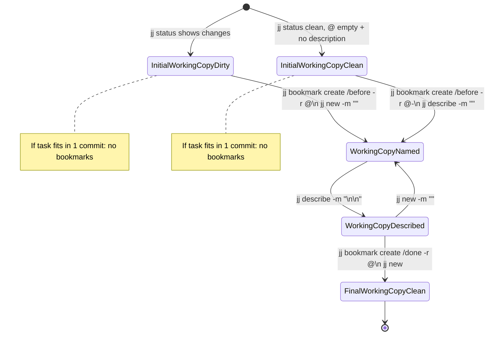

# opencode global rules

These rules are injected globally for OpenCode sessions.

## VCS detection

- Before running any VCS command, determine the VCS in use.
- If the project rules do not explicitly state the VCS, load and follow the `vcs-detect` skill.
- Use the detected VCS (`jj` vs `git`) consistently for the rest of the task.

## Tooling recommendations

- Prefer semi-automatic code editing when it is sufficient:
  - Use `ast_grep_search` / `ast_grep_replace` for simple mechanical refactors.
  - For tasks like “create a new file as a copy of another file”, “move/rename file”, or “copy file”, prefer shell commands like `cp` and `mv` instead of manual edits.

- Prefer built-in discovery tools:
  - Use `docs_search` (Context7 MCP) to look up library/framework documentation.
  - Use `grep_app` MCP to search for real-world code examples on GitHub.

- **Never discard unrelated changes** just because they look “extra”.
  - This includes any destructive commands in any VCS (e.g. `jj restore`, `git reset --hard`, `git checkout --`, force pushes, etc.).
  - If you accidentally mixed multiple concerns in one change, use `jj split` to separate them into multiple commits/changes.
  - If build/generated output (e.g. `flake.lock`) changes unexpectedly, keep it as a separate commit/change. The user decides whether to discard it and will do so themselves.
  - Only discard changes when the user explicitly asked you to do it.

## Jujutsu workflow

When the detected VCS is **Jujutsu** (`jj`), follow this workflow.

### State machine

### Legend

- `InitialWorkingCopyDirty`: working copy (`@`) contains file changes (`jj status` shows changes).
- `InitialWorkingCopyClean`: working copy (`@`) is empty and has no description; effectively a “fresh” workspace state.
- `WorkingCopyNamed`: work is in progress; the current change has a placeholder title (`<title-only>`), but the final message is not written yet.
- `WorkingCopyDescribed`: the current change is finalized with a full, documentative message (`<final title>\n\n<what/why>`).
- `FinalWorkingCopyClean`: task is finished; `<task>/done` bookmark is set and `jj new` has created an empty working copy for the next task.

### Transitions

- `[*] → InitialWorkingCopyDirty`: repository already has file changes in `@`.
- `[*] → InitialWorkingCopyClean`: repository starts with a clean, empty `@` (no description).

- `InitialWorkingCopyDirty → WorkingCopyNamed`: if this task needs multiple commits, bookmark the current state (`<task>/before`) and start a fresh empty working copy for the task with a placeholder title.
- `InitialWorkingCopyClean → WorkingCopyNamed`: if this task needs multiple commits, bookmark `@-` as `<task>/before` and name the current `@` with a placeholder title (so you don’t create an extra empty commit).

- `WorkingCopyNamed → WorkingCopyDescribed`: the current unit of work is done; finalize the message to reflect what was actually done (*what/why*).
- `WorkingCopyDescribed → WorkingCopyNamed`: there is more work left; start the next empty working copy commit for the next unit.

- `WorkingCopyDescribed → FinalWorkingCopyClean`: the task is done; create `<task>/done` and run `jj new` to leave an empty working copy.

### Notes

- In jj, you usually “commit” by *naming the current working copy commit* with `jj describe`.
- `jj new -m "..."` creates a new **empty** working copy commit for the next unit of work.
- Use documentative messages that explain *what* and *why*.
- It is especially important to `jj describe` (and optionally create a bookmark) **before any destructive/irreversible operation**.
- If you ended up making only a single commit/change for the whole task, delete the newly created bookmarks (they are redundant).

### Naming rules

- If the task comes from OpenSpec:
  - Use `<task>` = the OpenSpec `change` name.
  - If the current session implements only part of a `change`, then use:
    - `<change>/<task>/(before|done)`
    - The agent may choose a short, descriptive `<task>` name.
- Otherwise: agent is free to choose a short, descriptive name for `<task>` name.
